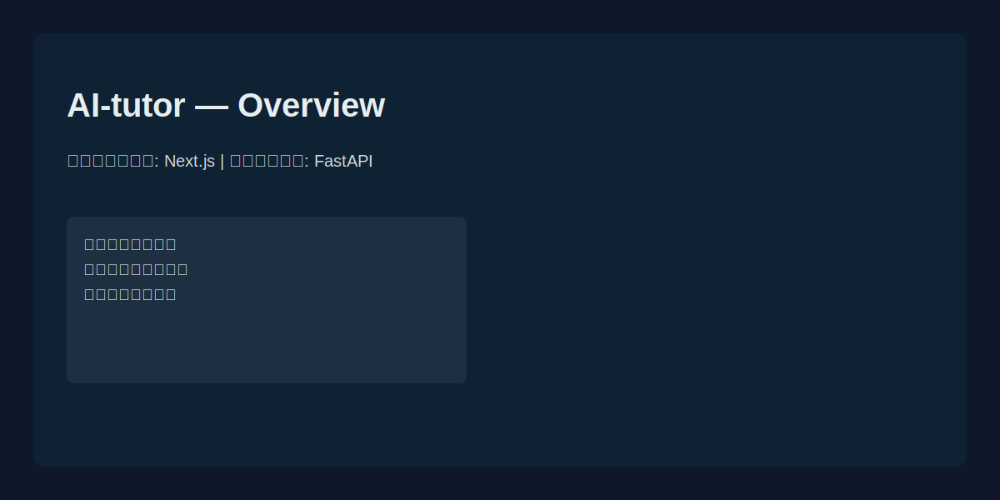
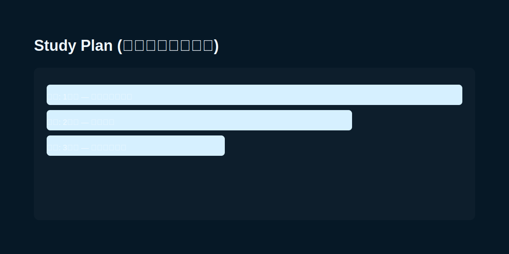

# AI家庭教師 (AI Tutor)

中高生向けのAI家庭教師Webアプリケーション。Google Gemini APIを使用して、学習計画の作成、質問への回答、進捗管理をサポートします。

## 主な機能

- 💬 **AIチャット**: Gemini 2.5 Flash による学習サポート
- 📚 **学習計画管理**: AI生成プランの保存と進捗追跡
- 📝 **メモ機能**: クイックメモの作成・管理
- 📱 **モバイル連携**: QRコード経由での画像アップロード
- 🎤 **音声入力**: ブラウザ標準の音声認識機能

## 技術スタック

- **Frontend**: Next.js 15 (App Router), React, TailwindCSS
- **Backend**: FastAPI, SQLAlchemy, SQLite
- **AI**: Google Gemini 2.5 Flash API

## セットアップ

### 前提条件
# AI-tutor

AIを活用した学習支援アプリケーション（フロントエンド: Next.js、バックエンド: FastAPI）。学習計画の生成、チャットによる質問応答、メモ・進捗管理などの機能を提供します。

## 主要機能

- AIチャットによる学習支援
- AI生成の学習計画作成・保存
- メモ（クイックメモ）の作成・管理
- 音声入力やモバイル画像アップロードの補助

## 技術スタック

- フロントエンド: Next.js (App Router), React, TailwindCSS
- バックエンド: FastAPI, SQLAlchemy, SQLite
- AI: Google Gemini 系 API（設定が必要）

## リポジトリ構成（抜粋）

```
AI-tutor/
├── backend/        # FastAPI アプリケーション
│   ├── main.py
│   ├── requirements.txt
│   └── app/        # アプリ本体 (routers, models, schemas など)
├── frontend/       # Next.js フロントエンド
│   ├── app/
│   ├── components/
│   └── lib/
└── docs/           # ドキュメント／実績メモ
```

## ローカル開発（簡易手順）

### 前提

- Node.js (推奨: 18+)
- Python (推奨: 3.10+)

### バックエンド起動

1. 仮想環境を作成・有効化

```powershell
cd backend
python -m venv .venv
.\.venv\Scripts\Activate.ps1
pip install -r requirements.txt
```

2. 必要な環境変数を用意（例: Gemini APIキー等）

3. アプリ起動（開発モード）

```powershell
uvicorn main:app --reload --port 8000
```

バックエンドは通常 `http://localhost:8000` で動作します。

### フロントエンド起動

```powershell
cd frontend
npm install
npm run dev
```

Next.js はデフォルトで `http://localhost:3000` に立ち上がります（プロジェクト固有の設定がある場合はそちらを参照してください）。

## 設定メモ

- Google Gemini 等のAPIキーは環境変数や `.env` に設定してください。
- DBは `backend/app/models.py` などでSQLiteを使用しています。プロダクション移行時は適宜設定変更が必要です。

## 貢献

- Issue / PR を歓迎します。小さな改善やドキュメント修正からお願いします。

## 参照ファイル

- バックエンド: [backend/main.py](backend/main.py)
- フロントエンド: [frontend/app/page.tsx](frontend/app/page.tsx)

---
更新: 現在のリポジトリ構成に合わせてREADMEを簡潔に整理しました。

## スクリーンショット

以下はプレースホルダーのスクリーンショットです。実際の画面キャプチャに差し替えてご利用ください。

- 概要画面



- チャット画面


- 学習計画画面


